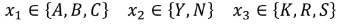
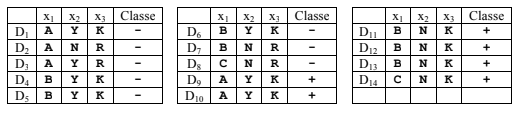
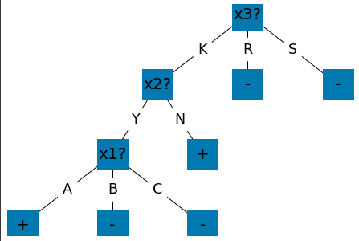

# ID3 Algorithm
Implementation of the ID3 Algorithm, which induces a Decision Tree from a set of examples.

## Usage
### Attributes:</br>
The following attributes:</br>
</br>
are represented as the following csv file:</br>
```
x1,A,B,C
x2,Y,N
x3,K,R,S
```
### Examples
The following examples:</br>
</br>
are represented as the following csv file:</br>
```
x1,x2,x3,class
A,Y,K,-
A,N,R,-
A,Y,R,-
B,Y,K,-
B,Y,K,-
B,Y,K,-
B,N,R,-
C,N,R,-
A,Y,K,+
A,Y,K,+
B,N,K,+
B,N,K,+
B,N,K,+
C,N,K,+
```
### Output
The program generates the following Decision Tree:</br>
</br>

## Built With
* [Pandas](https://pandas.pydata.org/)
* [Matplotlib](https://matplotlib.org/)
* [NetworkX](https://networkx.org/)

## Authors

* **João Bordalo** - *Initial work* - [jbordalo](https://github.com/jbordalo)

